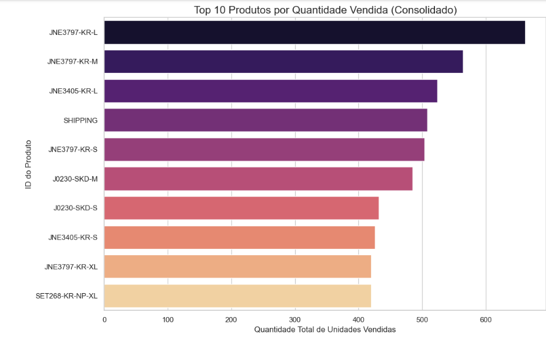

# Projeto de ETL e Análise de Vendas para E-commerce


<p align="center">
  
</p>

## 📜 Descrição Geral

Este projeto simula um fluxo de trabalho de dados ponta a ponta, desde a ingestão de dados brutos até a geração de insights acionáveis. O processo consiste em um pipeline de **ETL (Extração, Transformação e Carga)** que coleta dados de 7 fontes CSV distintas, os limpa, padroniza e carrega em um banco de dados PostgreSQL. Posteriormente, um notebook de análise consome esses dados tratados para explorar o desempenho de vendas, identificar tendências e visualizar os principais indicadores de negócio.

**Etapa 1: Dados Brutos (/data/raw)**
O ponto de partida foram 7 arquivos CSV com origens e estruturas distintas. Os dados nesta fase apresentavam inconsistências como nomes de colunas sem padrão, formatos de data variados e tipos de dados mistos.

**Etapa 2: Script de ETL (pre_processamento.py)**
O script de pré-processamento foi desenvolvido para automatizar a limpeza. A cada execução, ele realiza as seguintes tarefas:
- **Extração:** Lê os arquivos CSV padronizados da pasta /data/raw.
- **Transformação:** Aplica as regras de limpeza definidas na configuração `FILE_CONFIG`, como padronização de colunas para `snake_case`, conversão de datas e tratamento de dados faltantes.
- **Carga:** Carrega os DataFrames limpos em um banco de dados PostgreSQL, criando tabelas padronizadas (cln_...). Simultaneamente, salva uma cópia dos arquivos limpos na pasta `/data/clean` para fins de portfólio.

**Etapa 3: Banco de Dados (PostgreSQ)**
O PostgreSQL atua como a **fonte única da verdade** para a análise. Armazenar os dados limpos em um banco de dados garante que a etapa de análise seja desacoplada da limpeza, seguindo as melhores práticas de engenharia de dados.

**Etapa 4: Análise e Insights (analise.ipynb)**
O Jupyter Notebook de análise conecta-se exclusivamente ao banco de dados para consumir os dados já tratados. É nesta fase que os dados de diferentes fontes são consolidados e as perguntas de negócio são respondidas através de agregações, cálculos e, finalmente, a criação dos gráficos e a extração dos insights apresentados neste documento.

---

---

## ✨ Features Principais

- **Pipeline de ETL Robusto:** Um script Python automatizado que executa todo o processo de limpeza e carregamento de dados.
- **Limpeza e Padronização:** Tratamento de dados faltantes, padronização de nomes de colunas para o formato `snake_case` e conversão de tipos de dados (datas, números).
- **Banco de Dados Centralizado:** Utilização do PostgreSQL como uma "fonte única da verdade", armazenando os dados limpos em tabelas com prefixo `cln_` para fácil identificação.
- **Análise Consolidada:** Um Jupyter Notebook que une os dados de todas as fontes para criar uma visão holística do negócio.
- **Visualização de Dados:** Geração de múltiplos gráficos para responder perguntas de negócio chave, como:
  - Qual o faturamento mensal consolidado?
  - Quais os produtos mais vendidos por receita e por quantidade?
  - Quais as categorias de produtos mais lucrativas?

---

## 🛠️ Tecnologias Utilizadas

| Ferramenta | Propósito |
| :--- | :--- |
| **Python 3.9** | Linguagem principal para desenvolvimento do ETL e da análise. |
| **Pandas** | Biblioteca fundamental para manipulação e análise dos dados. |
| **PostgreSQL** | Sistema de gerenciamento de banco de dados para armazenar os dados limpos. |
| **SQLAlchemy** | Biblioteca Python para conectar e interagir com o banco de dados. |
| **Matplotlib & Seaborn** | Bibliotecas para a criação das visualizações de dados. |
| **Jupyter Notebook** | Ambiente interativo para a análise exploratória e apresentação dos resultados. |

---

## 🎯 Desafios e Soluções

Durante o desenvolvimento, alguns desafios interessantes surgiram, exigindo soluções específicas para garantir a qualidade dos dados.

| Desafio | Solução Implementada |
| :--- | :--- |
| **Múltiplas Fontes de Dados** | Criei um dicionário de configuração (`FILE_CONFIG`) para gerenciar as regras de cada arquivo de forma centralizada, tornando o script modular e fácil de estender. |
| **Formatos de Data Inconsistentes** | A função de ETL detecta formatos de data não-padrão (ex: "Jun-21") e aplica a conversão correta, unificando tudo para o tipo `datetime`. |
| **Colunas com Nomes Diferentes** | Implementei uma função de padronização para converter todos os nomes de colunas para um formato `snake_case` consistente antes de carregar no banco de dados. |
| **Dados Numéricos como Texto** | No notebook de análise, utilizei `pd.to_numeric` com `errors='coerce'` para forçar a conversão de colunas de faturamento, garantindo que valores não-numéricos (ex: texto) não quebrassem os cálculos. |

---

## 🚀 Como Executar o Projeto

Siga os passos abaixo para configurar e executar este projeto em seu ambiente local.

### 1. Pré-requisitos
- Python 3.9 ou superior
- PostgreSQL instalado e em execução.
- Git para clonar o repositório.

### 2. Clonando o Repositório
```bash
git clone [https://github.com/haykd7v/e-commerce_database.git](https://github.com/haykd7v/e-commerce_database.git)
cd e-commerce_database
```

### 3. Configuração do Ambiente
É altamente recomendado o uso de um ambiente virtual.
```bash
# Crie o ambiente virtual
python -m venv venv

# Ative o ambiente
# Windows
.\venv\Scripts\activate
# macOS / Linux
source venv/bin/activate
```

### 4. Instalação das Dependências
Instale todas as bibliotecas necessárias com um único comando.
```bash
pip install -r requirements.txt
```

### 5. Configuração do Banco de Dados
- Certifique-se de que seu servidor PostgreSQL esteja rodando.
- Crie um novo banco de dados chamado `ecommerce`.
- **Importante:** Verifique se as credenciais no script de ETL (`DB_ENGINE = create_engine(...)`) correspondem às suas (usuário, senha, porta).

### 6. Execução
O projeto deve ser executado em duas etapas, nesta ordem:

**Etapa 1: Rodar o Pipeline de ETL**
Este script irá limpar os dados da pasta `/data/raw` e carregá-los no seu banco de dados PostgreSQL.
```bash
python preprocessamento.py
```

**Etapa 2: Rodar o Notebook de Análise**
Abra o Jupyter Notebook `analise.ipynb` para ver a análise, os insights e os gráficos gerados a partir dos dados limpos no banco.
```bash
jupyter notebook analise.ipynb
```

---

## 📂 Estrutura do Repositório
```
├── data
│   ├── raw/                # Contém os 7 datasets originais e brutos.
│   └── clean/              # Onde os datasets limpos são salvos em formato CSV.
├── images/                 # Contém as imagens dos gráficos para o README.
├── analise.ipynb           # Notebook com a análise exploratória e visualizações.
├── preprocessamento.py     # Script principal de ETL.
├── requirements.txt        # Lista de dependências do projeto para fácil instalação.
└── README.md               # Esta documentação.
```

---

## 📊 Resultados e Insights
A análise dos dados consolidados revelou os seguintes insights chave:
- **Insight 1:** O produto mais vendido em **faturamento** foi o **J0D20-SKD-M**, enquanto o mais vendido em **quantidade** foi o **JNE3797-KR-L**, indicando a importância de produtos de menor valor para o volume de vendas.
- **Insight 2:** A categoria de **Kurta** é a mais rentável, respondendo por mais de **20%** do faturamento total analisado.

---

## 👨‍💻 Autor

- **Wallace Magalhães**
- **LinkedIn:** [Meu Perfil no LinkedIn](https://www.linkedin.com/in/euwallacee1/)
- **GitHub:** [haykd7v](https://github.com/haykd7v)
